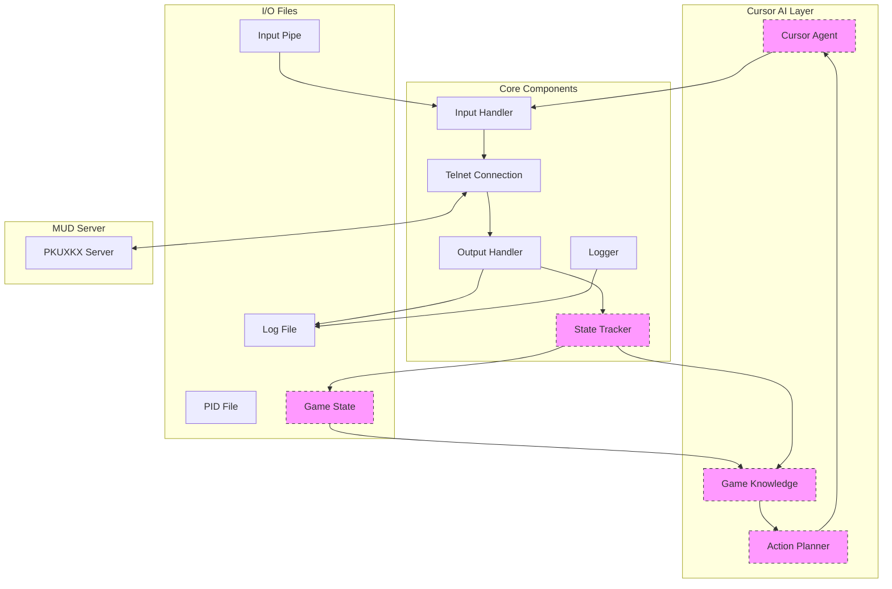

# PKUXKX MUD Agent

这是一个用于北大侠客行（PKUXKX）MUD 游戏的命令行客户端。它提供了一个后台运行的游戏会话，通过命令行与游戏进行交互，并支持 Cursor AI 辅助模式。

## 功能特点

- 后台运行游戏会话
- 支持 UTF-8 编码
- 实时日志记录
- 命令行交互（通过命名管道）
- 自动重连机制
- 信号处理和优雅退出
- Cursor AI 辅助模式（计划中）

## 系统架构



## 技术实现

### 核心组件
- **Telnet Connection**: 负责与 MUD 服务器的网络通信
- **Input Handler**: 处理来自命名管道的用户输入
- **Output Handler**: 处理服务器返回的游戏输出
- **Logger**: 日志记录系统，使用 rich 库提供美化输出

### Cursor AI 组件（计划中）
- **Cursor Agent**: AI 代理，负责游戏决策和行动
- **Game Knowledge**: 游戏知识库，存储地图、物品、NPC等信息
- **Action Planner**: 行动规划器，根据当前状态和目标生成行动序列
- **State Tracker**: 状态追踪器，维护游戏世界状态

### 运行时文件
- **mud_output.log**: 游戏输出日志
- **mud_input_pipe**: 命令输入管道
- **mud.pid**: 进程 ID 文件
- **game_state.json**: 游戏状态存储（计划中）

## 安装和配置

1. 克隆仓库：
```bash
git clone https://github.com/daymade/pkuxkx-mud-agent.git
cd pkuxkx-mud-agent
```

2. 安装依赖：
```bash
pip install -r requirements.txt
```

3. 配置环境变量：
```bash
cp .env.example .env
```
然后编辑 `.env` 文件，填入你的账号信息：
```
MUD_HOST=mud.pkuxkx.net
MUD_PORT=8081
MUD_USERNAME=your_username
MUD_PASSWORD=your_password
```

## 使用方法

1. 启动代理：
```bash
python mud_agent.py
```

2. 查看游戏输出：
```bash
tail -f mud_output.log
```

3. 发送命令：
```bash
echo "命令" > mud_input_pipe
```

4. 停止代理：
```bash
kill $(cat mud.pid)
```

## 项目结构

```
pkuxkx-mud-agent/
├── mud_agent.py      # 主程序
├── requirements.txt  # 依赖列表
├── .env.example     # 环境变量示例
├── .env            # 实际环境变量（不提交到git）
├── .gitignore     # git忽略文件
└── README.md      # 说明文档
```

## 依赖说明

- python-dotenv (1.0.0): 用于加载环境变量
- rich (10.16.2): 用于美化控制台输出

## 贡献

欢迎提交 Issue 和 Pull Request！

## 许可证

MIT License 